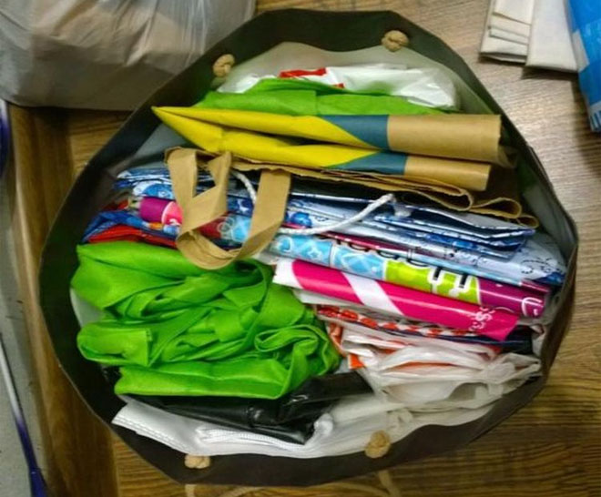
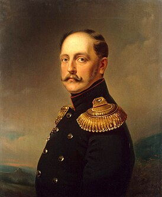

```{r setup, include=FALSE}
knitr::opts_chunk$set(echo = TRUE, message = FALSE, warning = FALSE, error = FALSE, fig.width=16, fig.height=10)

library(tidyverse)
library(ggExtra)
library(ggridges)
library(ggpubr)

# Избавляемся от scientific notation
options(scipen = 999)
```

## Загрузка данных

```{r}
hogwarts <- read_csv("data/hogwarts_2024.csv")
hogwarts |> head()
```

### Проверка структуры данных

```{r}
hogwarts |> glimpse()

# Changing some variables type to factors
hogwarts <- hogwarts |> mutate(
  across(c(house, course, sex, wandCore, bloodStatus), ~ as.factor(.x))
)
```

### Поиск пропущенных значений

```{r}
sum(is.na(hogwarts))
```

### Сводка по данным

```{r}
hogwarts |> summary()
```

### Пересоздание theme_custom

```{r}
theme_custom <- theme(
    panel.background = element_rect(fill = "white"),
    plot.title = element_text(size = 30, hjust = 0.5),
    plot.subtitle = element_text(size = 25, hjust = 0.5),
    strip.text = element_text(size = 20),
    axis.text = element_text(size = 20),
    axis.title = element_text(size = 25),
    legend.title = element_text(size = 25),
    legend.text = element_text(size = 20)
  )
```

### Функции и конвееры

Обсудим функции

```{r}
test_function1 <- function(x){
  y <- x * 3
  return(y)
}

test_function1(2)
test_function1(5)
```

Если функции не задать return, она вернет значение, образовавшееся в ходе последнего действия

```{r}
test_function1 <- function(x){
  x * 3
}

test_function1(2)
test_function1(5)

test_function2 <- function(x){
  y <- x * 3
  2 + y
}

test_function2(2)
test_function2(5)
```


Попробуем создать относительно универсальную функцию для создания гистограмм

```{r}
histCustom <- function(df, x){
  customPlot <- ggplot(df)+
    geom_histogram(aes(x = x),
                   color="black",
                   fill = "aquamarine2",
                   bins = 20)+
    labs(title = "Histogram",
         caption = "No source of data",
         y = "Number of objects")+
    theme_custom
  
  return(customPlot)
}

histCustom(hogwarts, result)
```

```{r}
histCustom <- function(df, mapping){
  customPlot <- ggplot(df)+
    geom_histogram(mapping,
                   color="black",
                   fill = "aquamarine2",
                   bins = 20)+
    labs(title = "Histogram",
         caption = "No source of data",
         y = "Number of objects")+
    theme_custom
  
  return(customPlot)
}

histCustom(hogwarts, aes(x = result))
```

Дубль 3

```{r}
histCustom <- function(df, x){
  customPlot <- ggplot(df)+
    geom_histogram(aes(x = df[[x]]),
                   color="black",
                   fill = "aquamarine2",
                   bins = 20)+
    labs(title = "Histogram",
         caption = "No source of data",
         x = x,
         y = "Number of objects")+
    theme_custom
  
  return(customPlot)
}

histCustom(hogwarts, "result")
```

Дубль 4

```{r}
histCustom <- function(df, x){
  customPlot <- ggplot(df)+
    geom_histogram(aes(x = {{x}}),
                   color="black",
                   fill = "aquamarine2",
                   bins = 20)+
    labs(title = "Histogram",
         caption = "No source of data",
         y = "Number of objects")+
    theme_custom
  
  return(customPlot)
}

histCustom(hogwarts, result)
```

Сделаем пару шагов назад.

Можно задать аргументу функции значение по умолчанию

```{r}
test_function1 <- function(x = 2){
  y <- x * 3
  return(y)
}

test_function1(2)
test_function1(5)
test_function1()
```

Можно разрешить принимать непрописанные аргументы

```{r}
test_function1(3)
test_function1(x = 3)
test_function1(m = 3)

test_function1 <- function(x = 2, ...){
  y <- x * 3
  return(y)
}

test_function1(m = 3)
```

Применим функцию к одному из слоев.

```{r fig.height=40, fig.width=40}
# График-подложка
plotTemplate <- ggplot(hogwarts)+
  labs(title = "Histogram",
         caption = "No source of data",
         y = "Number of objects")+
    theme_custom

# Функция для подбора числа бинов
histBinCustom <- function(){
  
}

# Создание конвеера
binNumbers <- c(3, 5, seq(10, 20, 2), seq(25, 100, 5), seq(100, 500, 100))


# Вывод итогового графика
```

Резюме.

1\. Если требуются однотипные графики, в которых изменяется малое число эстетик, можно сделать функцию с графиком ggplot внутри.

2\. Оборачивание переменной внутри функции в curly-curly (`{{}}`) позволяет передавать в качестве этой переменной столбец датафрейма.

3\. Для создания конвееров удобно сочетать самодельные функции с графиками и конвеерные функции из пакета `purrr`.

4\. При создании самодельной функции с использованием одной функции ggplot, аргументам по умолчанию можно задать значение в скобках после слова `function`.

5\. Хорошая практика -- добавлять `...` в список возможных аргументов функции.

## Экосистема пакетов



Большой и шумный датафрейм (он в поросятах знает толк)

```{r}
# Новый датафрейм (единица наблюдения -- результат экзамена)
examHogwarts <- hogwarts |> 
  select(id, where(is.factor), ends_with("exam"), result) |> 
  pivot_longer(-c(id, where(is.factor), result), names_to = "exam", values_to = "mark")

noisyScatter <- ggplot(examHogwarts)+
  geom_point(aes(x = result, 
                 y = mark,
                 colour = house))+
  scale_colour_manual(values = c("Gryffindor" = "#C50000", 
                           "Hufflepuff" = "#ECB939", 
                           "Ravenclaw" = "#41A6D9", 
                           "Slytherin" = "#1F5D25"))+
  theme_custom
```

### Маргинплоты

Базовая версия

```{r}

```

Добавляем группы

```{r}
ggMarginal(noisyScatter)
```

Модифицируем краевые графики

```{r}
ggMarginal(noisyScatter)
```

```{r}
ggplot(examHogwarts,
       aes(x = result,
           y = mark))+
  theme_custom
```

### Риджлайн

```{r}
ggplot(examHogwarts)+
  geom_density(aes(x = mark, fill = exam),
               alpha = 0.3)+
  theme_custom
```

```{r}
ggplot(examHogwarts)+
  theme_custom

```

Добавляем градиент

```{r}
examHogwarts |> 
  mutate(mark = case_when(
    exam == "Divinations exam" ~ mark + 40,
    exam == "Astronomy exam" ~ mark - 40,
    TRUE ~ mark
  )) |> 
  ggplot()+
  theme_custom
```

Резюме.

1\. Для отдельной оценки распределений, связь между которыми мы смотрим на скаттерплоте, можно использовать маргинальные графики `ggMarginal()` из пакета `ggExtra`.

2\. Другой способ оценить связь между двумя переменными с большим количеством наблюдений -- двумерные гистограммы `geom_bin2d()`.

3\. Дополнительный способ сравнить распределение нескольких количественных переменных -- риджлайны из пакета `ggridges`.

## Изменение шкалы

```{r}
# Новый датафрейм -- сумма стипендии в Хогвартсе
scolarshipHogwarts <- hogwarts |> 
  mutate(
    across(ends_with("exam"),~ .x * (result**2 / 100)) |> round(0),
    ) |> 
  rowwise() |> 
  mutate(
    scolarship = sum(c_across(ends_with("exam")))
  )

standardScales <- ggplot(scolarshipHogwarts)+
  geom_histogram(aes(x = scolarship),
                 colour = "black",
                 fill = "red")+
  scale_x_continuous(breaks = seq(0, 600000, l=3))+
  geom_vline(xintercept = seq(0, 600000, l=3),
             colour = "black",
             linetype = "dashed")+
  theme_custom

logScales <- ggplot(scolarshipHogwarts)+
  geom_histogram(aes(x = scolarship),
                 colour = "black",
                 fill = "forestgreen")+
  scale_x_log10(breaks = c(1, 10, 100, 1000, 10000, 100000))+
  geom_vline(xintercept = 1000,
             size = 2, 
             colour = "lightblue",
             linetype = "dashed")+
  theme_custom

ggarrange(standardScales, logScales)
```

```{r}
logone <- scolarshipHogwarts |> 
  mutate(
    scolarship = log10(scolarship)
  ) |> 
  ggplot()+
  geom_histogram(aes(x = scolarship),
                 colour = "black",
                 fill = "forestgreen")+
  theme_custom

logtwo <- scolarshipHogwarts |> 
  mutate(
    scolarship = log10(scolarship)
  ) |> 
  ggplot()+
  geom_histogram(aes(x = scolarship),
                 colour = "black",
                 fill = "forestgreen")+
  xlab(label = "scolarship (log10)")+
  theme_custom
  
logthree <- ggplot(scolarshipHogwarts)+
  geom_histogram(aes(x = scolarship),
                 colour = "black",
                 fill = "forestgreen")+
  scale_x_log10()+
  theme_custom
  
logfour <- ggplot(scolarshipHogwarts)+
  geom_histogram(aes(x = scolarship),
                 colour = "black",
                 fill = "forestgreen")+
  scale_x_log10()+
  xlab(label = "scolarship (log10)")+
  theme_custom

ggarrange(plotlist = list(logone, logtwo, logthree, logfour))
```

## Аннотации

```{r}
noisyScatter

# -200 60    -300 -50 75 100     -275 -300 60 74    0 50
```

Резюме:

1\. Для данных с большим разбросом значений удобно использовать логарифмическую шкалу.

2\. Стоит помнить о том, что если на оси отложены значения логарифма, то ось должна быть подписана соответствующим образом (log).

3\. Аннотация -- удобный инструмент, чтобы расставить акценты на отдельных частях графика и привлечь внимание читателя.



## Ссылочная

-   [Сайт с примерами графиков и полезными советами](https://r-graph-gallery.com/)
-   [Оригинальная статья с изложением философии ggplot](https://byrneslab.net/classes/biol607/readings/wickham_layered-grammar.pdf)
-   [Документация ggplot](https://ggplot2.tidyverse.org/)
-   [Учебник по data-science от авторов ggplot](https://r4ds.hadley.nz/)
-   [Книга о некоторых принципах визуализации с полезными советами, но без явного отображения кода](https://clauswilke.com/dataviz/)
-   [Пакеты-расширения ggplot2](https://exts.ggplot2.tidyverse.org/gallery/)
-   [Учебник по ggplot от авторов ggplot (в процессе написания)](https://ggplot2-book.org/)
-   [Телеграм-канал про визуализацию (не в биомедицине, и не на R, но от этого не менее хороший)](https://t.me/nastengraph)
-   [Шпаргалка по ggplot2](https://rstudio.github.io/cheatsheets/html/data-visualization.html)
-   [Шпаргалка по rmd](https://posit.co/wp-content/uploads/2022/10/rmarkdown-1.pdf)
